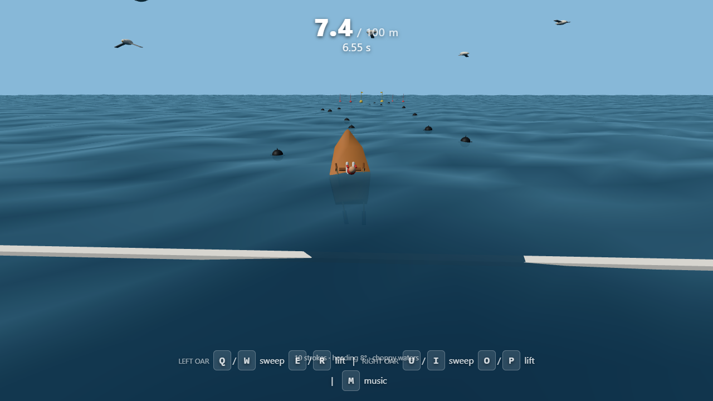

# ROWP — a QWOP-style rowing disaster 🚣



ROWP is a chaotic 3D physics rowing game in the spirit of [QWOP](https://www.foddy.net/Athletics.html).
You control each oar directly — sweep it in a full circle around the oarlock to pull,
feather, and recover. Rowing is *hard*. Steering is *harder*. And the seagulls… the
seagulls are *unforgivable*.

**Play it now:** https://ferozaffs.github.io/qwop-row/

## How to play

| Key | Action |
|-----|--------|
| `Q` / `W` | Left oar sweep aft / forward |
| `E` / `R` | Left oar lift / dunk |
| `U` / `I` | Right oar sweep aft / forward |
| `O` / `P` | Right oar lift / dunk |
| `M` | Toggle music |

- Each oar has two axes — **sweep** and **lift** — so a proper circular stroke
  is: *dunk* the blade, *pull* it through the water, *lift* it out, *swing*
  forward, repeat. Miss a phase and the blade plows or brakes.
- Oars spin through a **full rotation** — timing the lift/dunk is the game.
- Cross the finish line **between the yellow buoys** — miss the gate and you have
  to row back.
- Both oars in sync row straight; one side at a time steers.
- **Watch out for:** waves, sea mines (they explode… loudly), and seagulls that
  dive-bomb your hull and knock it around.

## Multiplayer races

- **HOST RACE** gives you a word code like `tide-otter-37` — share it.
- Up to 6 players join with **JOIN + code**; boats start side-by-side in lanes.
- Input stays locked until everyone's in, then the host starts a
  5-4-3-2-1 countdown.
- First boat through the gate wins. There's no reset button — victory speaks
  for itself.
- Mobile-friendly: dual virtual joysticks (x = sweep, y = lift) appear automatically on phones/tablets.

Runs entirely peer-to-peer (WebRTC via PeerJS) — no game server needed.

## Tech

- Single self-contained `index.html` — Three.js from CDN, no build step
- **Real wave physics**: 4 superimposed wave components defined once and
  injected into both the GPU water shader and the CPU buoyancy model, so what
  you see is what the boat feels
- Hull buoyancy sampled at bow/stern/port/starboard, spring-damper heave,
  wave-slope pitch/roll
- Oars are proper drag bodies — blade velocity through water produces force +
  torque vector (thrust, yaw, roll, pitch), applied at the blade position
- Keel model (lateral drag + weathervane torque) keeps courses rowable
- Procedural WebAudio: sea-shanty-ish loop, oar swishes, gull thumps, mine
  booms, finish bell; no audio assets
- Deterministic per-race seed drives wave-prone hazards identically for every
  racer

## Running locally

Open `index.html` in any modern browser (needs internet for the Three.js/PeerJS
CDNs). Or:

```
npx serve .
```

## Development

A headless smoke-test harness simulates rowing, steering, gull attacks, the
gate finish and multiplayer message flows without a browser:

```
node path/to/harness.js     # prints PASS/FAIL lines
```

## License

MIT — have fun, and remember: it's QWOP, but wet.
